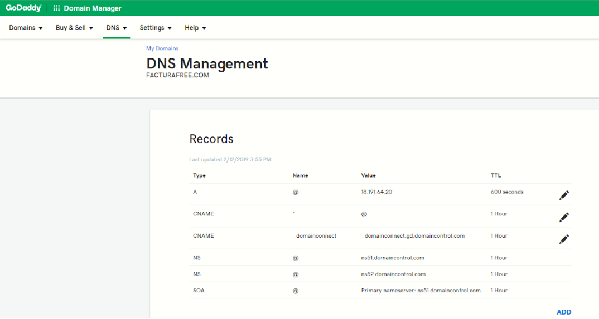
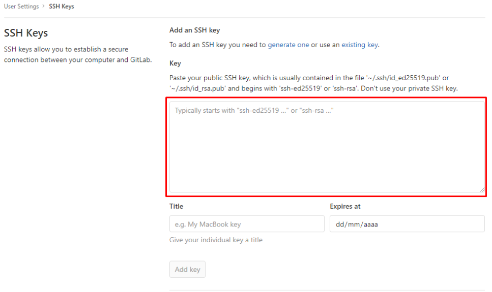

# Manual para Script de Instalación

## Descripcion

Hemos elaborado un script para uso en instancias Linux con Ubuntu 18 o superior, este es un archivo que actualiza el sistema, instala las herramientas, sus dependencias y realiza todas las configuraciones previas, dejando el aplicativo listo para probar en menos de 20 minutos (siempre y cuando el dominio ya esté configurado hacia la instancia), su ejecución es muy sencilla.

### Requisitos previos

1. Tener acceso a su servidor, vps, máquina virtual o local via SSH, en las instalaciones que realizamos para AWS o Google Cloud, hacemos entrega del usuario, la IP del servidor y la clave ssh que puede ser un archivo .ppk o .pem, recuerde almacenarlas en su equipo local.

2. Tener instalado una versión de ssh en su máquina para conectarse de manera remota, puede utilizar putty, filezilla o una consola terminal. para mayor información sobre el acceso SSH visite los siguientes manuales:
[Guía para acceder con Putty (gestión de servidor)](https://docs.google.com/document/d/1PmQejvNd_dkXVm8DPUYlQTag0wvES46tMpxX3MPhkNY/edit#)
[Guía para acceder con Winscp (gestión de archivos con aplicación de escritorio)](https://docs.google.com/document/d/1Xpri2102N4b5C-dG-FVPXW5ZWjEz5S4iDjpvl7Zwq2E/edit#heading=h.nezjsyganf1w)

3. Si es posible configurar su dominio apuntando a su instancia para que al finalizar la instalación se encuentre disponible el aplicativo. Edite los récords A y CNAME donde A debe contener su IP y CNAME el valor * (asterisco) para que se tomen los subdominios registrados por la herramienta.

4. En caso de contar con servicios instalados en su instancia como mysql, apache o nginx, debe detenerlos, ya que estos ocupan los puertos que pasarán a usar el aplicativo con los contenedores de Docker

#### Pasos

1. Acceder a su instancia vía SSH.

2. Loguearse como super usuario ejecute:
~~~
    sudo du
~~~

3. Clonar el snippet de gitlab que contiene el script 
~~~
git clone https://gitlab.com/snippets/2079063.git script
~~~

4. Ingrese a la carpeta clonada 
~~~
cd script
~~~

5. Dar permisos de ejecución al script
~~~
chmod +x install.sh
~~~

6. El comando a utilizar para iniciar el despliegue requiere de un parámetro principalmente: `./install.sh [dominio]` 
**por ejemplo:** 
~~~
./install.sh facturador.pro
~~~

7. Una vez ejecutado el comando, iniciará el proceso de actualización del sistema. Durante el proceso, se le solicitará:

    a. El usuario y contraseña de GitLab para descargar el proyecto en su instancia.

    b. Si desea instalar un SSL gratuito. Tenga en cuenta que este debe ser actualizado cada 90 días. El mensaje será el siguiente:
    

        1. Deberá responder con “s” o “n” para continuar.

        2. Si selecciona **SÍ** , deberá contestar las siguientes preguntas con “y”, son 2 en total, seguidamente se le ofrecerá un código que debe añadir en un récord tipo TXT en su dominio quedando como **_acme-challenge.example.com** o simplemente **_acme-challenge** dependerá de su proveedor. 

        3. para continuar presione enter, luego deberá repetir las acciones para añadir un segundo código y habrá finalizado la configuración, si el proceso es exitoso la ejecución del script continuará.

    c. Si desea obtener y gestionar actualizaciones automáticas, deberá disponer de su sesión de gitlab al momento. 

        1. Deberá contestar con “s” o “n” para continuar.

        2. De seleccionar SÍ, al final del despliegue se le dará un extracto de texto que debe añadir a su configuración de gitlab. 
8. Finalizado el script y dependiendo de sus selecciones anteriores, se le entregará varios datos que debe guardar, como:

    a. usuario administrador

    b. contraseña para usuario administrado

    c. url del proyecto
 
    d. ubicación del proyecto dentro del servidor

    e. clave ssh para añadir a gitlab (obligatorio para quienes seleccionan la instalación de SSH)

##### Enlaces de interés

* [Actualizacion de SSL](https://gitlab.com/b.mendoza/facturadorpro3/snippets/1955372)
* [Actualización mediante ejecución Script para instalaciones Docker](https://gitlab.com/b.mendoza/facturadorpro3/-/wikis/Script-Update-Docker)
* [Gestión de SSL independiente, no el que incorpora el Script](https://docs.google.com/document/d/1D87YJ9fq9yHiAauu6SGVugiC3m_i42DrFUt6VKYXuDI/edit?usp=sharing)
* [Guía gitlab para la instalación, contiene el script usado en el presente manual](https://gitlab.com/b.mendoza/facturadorpro3/snippets/1971490) , además posee los parámetros extras que pueden usarse en la ejecución del paso 6

